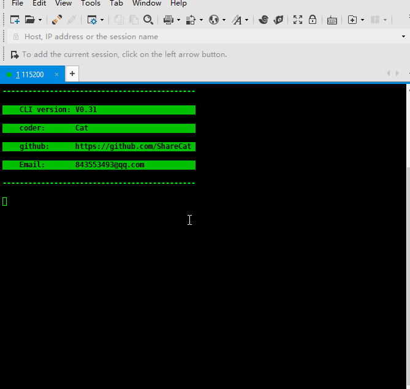
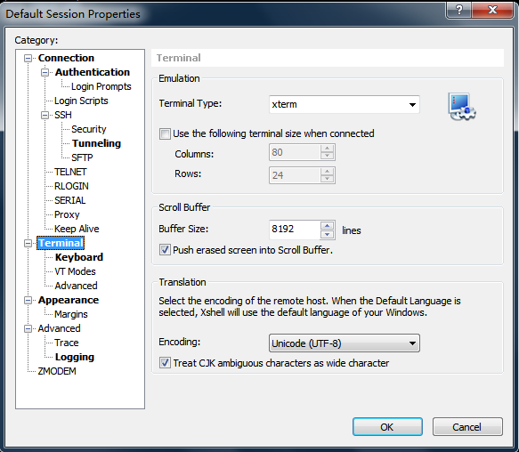
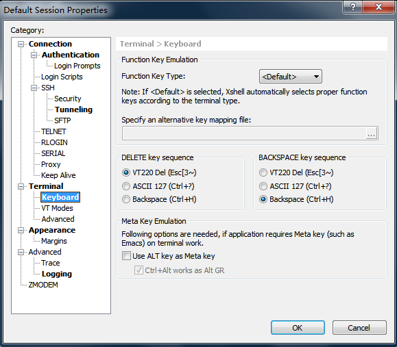
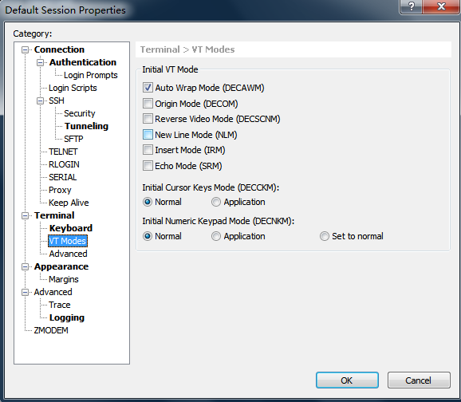
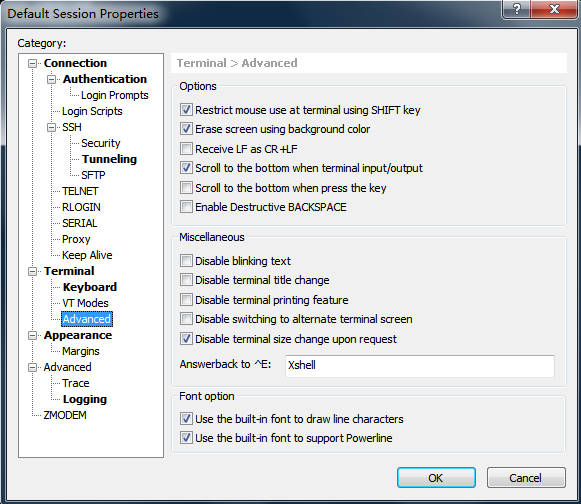
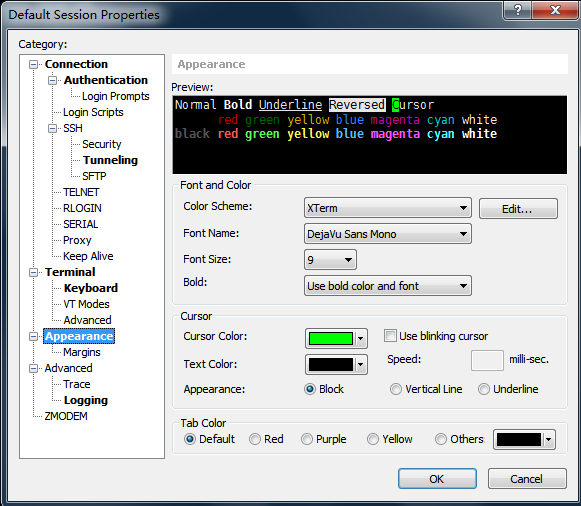

# STM32CommandLine

___

## 1. DEMO
- **1.1** ：Connect the MCU and Xshell with UART port.
```
   | | |                _.--------._
  .-----.               |    PC    |
--|o    |----UART_TX----|  Xshell  |
--|     |----UART_RX----|          |
  '-----'               '----------'
   | | |
```
- **1.2** ：Check this demo: (using Xshell for terminal, you can also choose SecureCRT if you like)


- **1.3** ：Here is my configurations of Xshell:






___

## 2. 介绍（[English](#2-introduction)）
- **2.1** ：一个**命令行**运行在stm32上，只需要提供一个串口即可实现。
- **2.2** ：配合队列处理串口数据，快速响应并退出中断。
- **2.3** ：可以移植到任意嵌入式系统，甚至51、AVR、PIC、stm8s等。
- **2.4** ：命令支持后续扩展，**支持多种颜色**的log输出到终端，方便调试。

___

## 2. Introduction

- **2.1** : This project is a shell, a CLI(command line interface) like linux shell, demo project is based on STM32(a serial com port is needed).
- **2.2** : A fifo queue added for faster IRQ handler.
- **2.3** : You can port this shell into an embeded system, even 51, AVR, PIC, stm8s and so on..
- **2.4** : You can also add your own commands, it is helpful for programmers to debug, also support **colorful debug fonts**.

## 3. TODO
- [x] A list of history command support.
- [ ] Command Completion.
